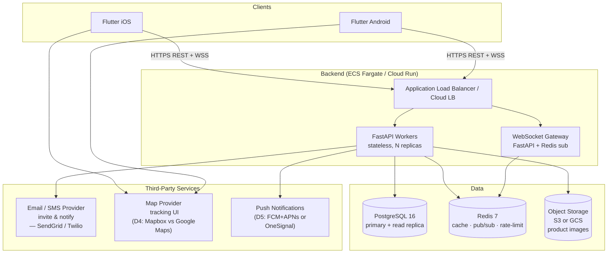
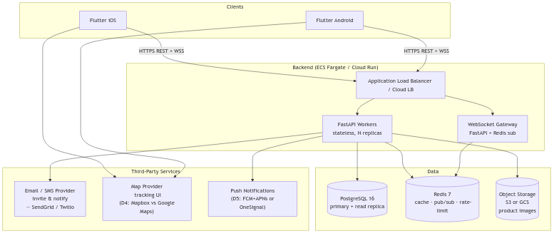
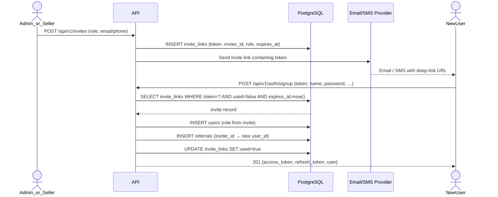
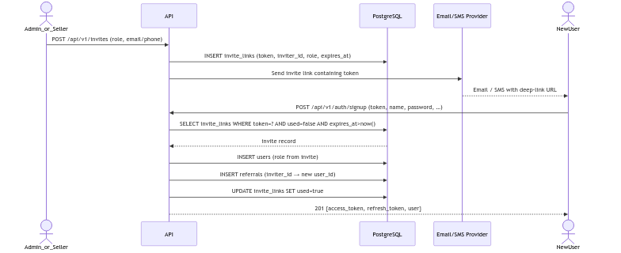
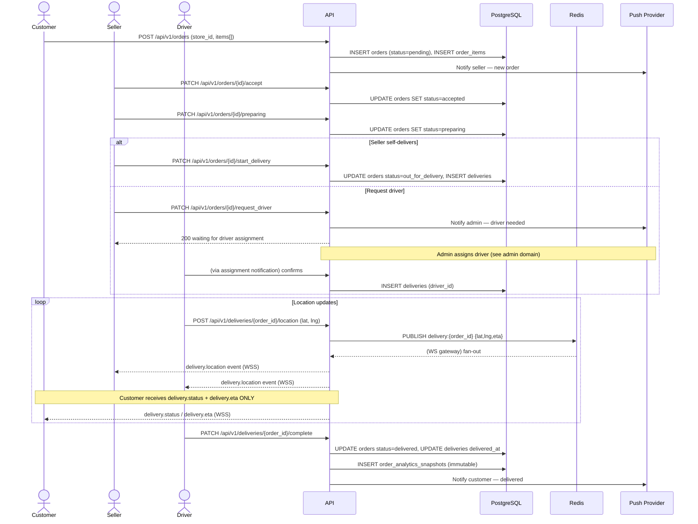
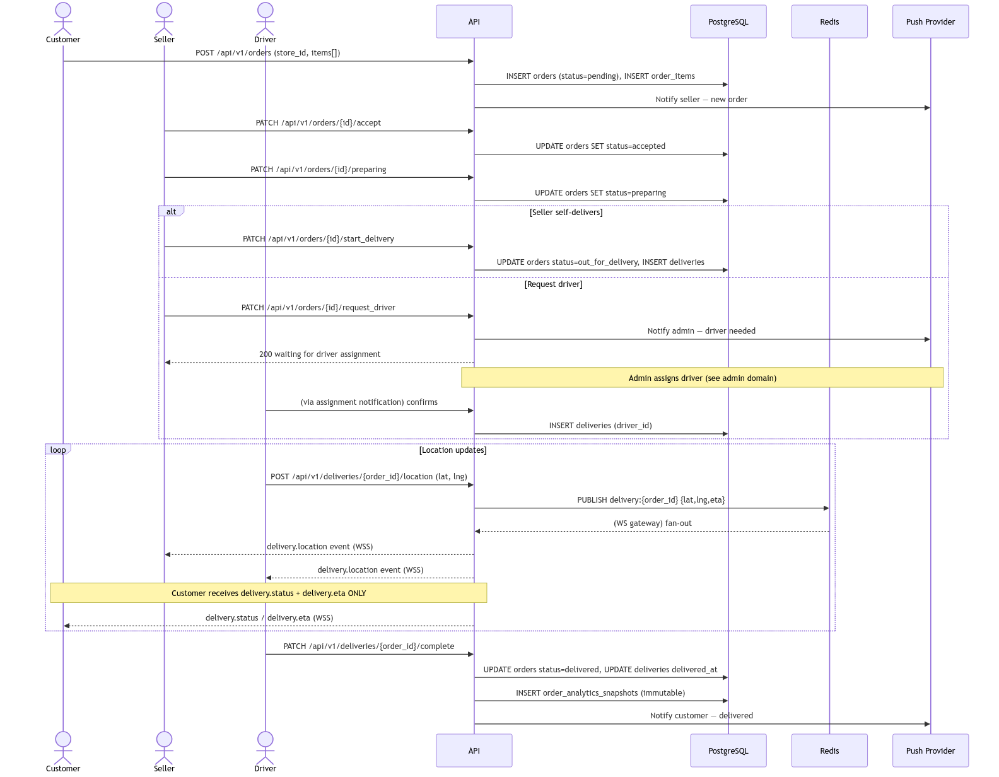
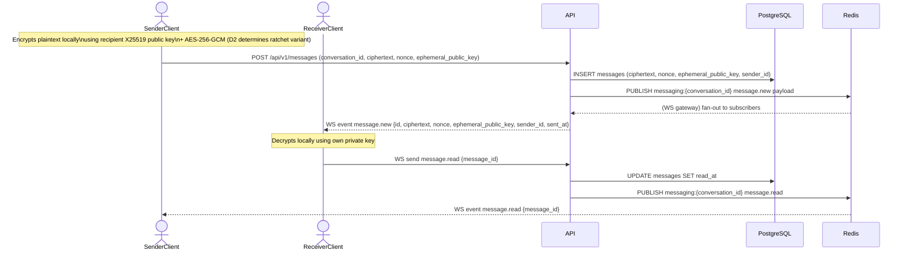
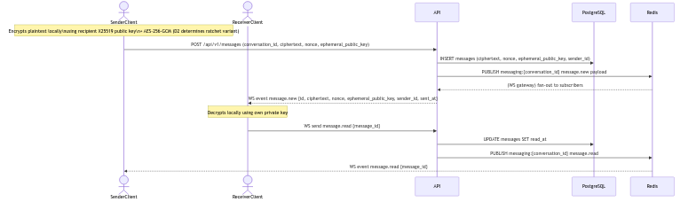
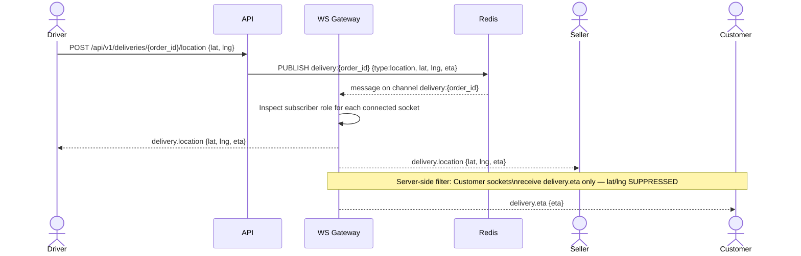
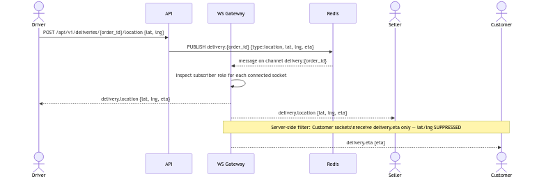

# Architecture — Invite-Only Marketplace

> **Phase 1 deliverable.** Source of truth: [PROJECT.md](../PROJECT.md). All naming follows §5.2 conventions. Open decisions D1–D5 (§7) are referenced where they affect design.

---

## 1. Executive Summary

The platform is a mobile-first, invite-only marketplace. Flutter clients (iOS + Android) communicate exclusively with a stateless FastAPI backend over HTTPS REST and WebSocket connections. PostgreSQL 16 is the system of record; Redis 7 provides pub/sub for WebSocket fanout and rate-limit counters. Object storage (S3/GCS) holds product images behind signed URLs. Third-party providers handle outbound email/SMS for invite delivery, map rendering for the tracking UI, and push notifications.

The architecture is designed to be **deployment-portable** between AWS ECS Fargate and GCP Cloud Run (see open decision D1), with configuration driven entirely by environment variables. All service boundaries are drawn to allow independent horizontal scaling of the highest-throughput domains (auth, products, delivery) without affecting others.

---

## 2. System Context Diagram



<!-- rendered image -->



---

## 3. Service Boundaries

All backend code lives in a single FastAPI process (no microservices yet), but is **logically partitioned** into domain packages under `app/api/v1/`. Each domain owns its router, Pydantic schemas, service layer, and ORM models. This structure allows extraction to separate services if throughput demands it later.

### 3.1 auth

**Responsibility:** Identity, session lifecycle, invite token validation, RBAC enforcement.

- Issues JWT access tokens (15 min TTL) and rotating refresh tokens (7 days TTL) via Argon2id password verification.
- Validates invite tokens at signup; binds the new account to the correct referral chain and role.
- Provides dependency-injectable RBAC guards (`require_role(...)`) consumed by every other domain.
- Enforces rate limits (Redis counters) on login, signup, and token-refresh endpoints.
- Stores refresh tokens as hashed values in `refresh_tokens` table for rotation and revocation.

### 3.2 users

**Responsibility:** Profile data for all roles; role metadata.

- Stores core identity (name, phone, email) and role tag in the `users` table.
- Exposes profile read/update scoped to the authenticated user (customers, sellers) or unrestricted for admin.
- No business logic — delegates referral chain reads to the `admin` domain's referral-graph view.

### 3.3 sellers / stores

**Responsibility:** Seller entity, one-to-one `stores` record, city scoping.

- A `sellers` record extends a `users` row (1:1, same UUID). A `stores` record is 1:1 with `sellers`.
- Every store is pinned to a `city` field; all product and order queries are implicitly scoped.
- Exposes a public seller "page" that is only reachable by customers whose referral chain includes that seller (enforced in the product-listing query join on `referrals`).
- Admin can list all stores across cities.

### 3.4 products

**Responsibility:** Full product CRUD, image signed-URL issuance, visibility scoping.

- Product listing for customers filters via a `referrals` join: only products belonging to the seller who referred the customer (directly or via chain) are visible.
- Image uploads: backend issues a pre-signed PUT URL (S3/GCS); client uploads directly. The `product_images` column stores the resulting object key.
- Soft-delete: `deleted_at` set on product rows; queries exclude soft-deleted unless called by the owning seller or admin.

### 3.5 orders

**Responsibility:** Order lifecycle from placement to completion; retention enforcement; analytics snapshot trigger.

- States: `pending → accepted → preparing → out_for_delivery → delivered → (cancelled)`
- Soft-delete enforced: orders cannot be hard-deleted until `MIN(seller_retention_days, platform_min_retention_days)` have elapsed after delivery; background job enforces this.
- On transition to `delivered`, a background task writes an immutable `order_analytics_snapshots` record (total, items, seller_id, city) that persists independently of the order row.
- Cancellation: allowed by customer (pre-`accepted`) or admin at any state.
- Fulfillment path: seller chooses `start_delivery` (self-delivers) or `request_driver` (admin assigns driver from driver pool).

### 3.6 delivery

**Responsibility:** Delivery record lifecycle, asymmetric location visibility, ETA, metrics.

- A `deliveries` row is created when seller transitions order to `out_for_delivery`.
- Location updates arrive via REST POST or WebSocket from the driver/seller.
- **Asymmetric visibility rule (enforced server-side):** `delivery.location` events are broadcast only to the driver and seller WebSocket subscribers. Customers receive only `delivery.status` and `delivery.eta` events. This filter is applied in the WebSocket gateway before publish, not in the client.
- Metrics stored: `started_at`, `delivered_at`, duration computed on completion.

### 3.7 messaging

**Responsibility:** E2E ciphertext storage and retrieval; conversation management; public-key registry.

- Server stores **ciphertext only**. Keys (X25519 public keys) are registered per-user; private keys never leave the device.
- `conversations` table represents a participant pair (or group, future). `messages` rows hold encrypted payload + sender_id + conversation_id.
- REST fallback for send/receive; real-time delivery via `/ws/v1/messaging` pub/sub.
- Open decision D2 (X25519+AES-GCM vs Signal double-ratchet) affects the key-registration and ratchet state fields; current schema reserves space for ratchet state as a nullable JSONB column.

### 3.8 admin

**Responsibility:** Cross-domain management, driver assignment, platform settings, referral graph visualization.

- Endpoints behind `require_role(admin)` guard.
- Driver assignment: admin POSTs to `/api/v1/orders/{id}/assign_driver`, triggering a `driver_assignments` record and notifying the driver via push + WebSocket.
- Platform settings stored in `platform_settings` (singleton row, key-value or typed columns).
- Referral graph: a read-optimized view/query over `users` ↔ `referrals` ↔ `invite_links` returned as a node-edge list for the admin UI.
- User management: soft-delete users (sets `deleted_at`; orders/messages retained per retention rules).

### 3.9 analytics

**Responsibility:** Lifetime sales snapshot aggregation; seller dashboard summary.

- `order_analytics_snapshots` is an append-only table written at order completion time. It is **never soft-deleted** and survives order purges.
- Aggregation is computed on-read for the seller dashboard (sum of `total_amount` grouped by seller) with a Redis-cached result (TTL configurable).
- Scheduled background job (nightly) can pre-aggregate into a `seller_sales_rollups` materialized-view or summary table if query latency becomes an issue.
- Admin can query aggregate sales across all sellers.

---

## 4. Data Flow Diagrams

### 4.1 Invite → Signup



<!-- rendered image -->



### 4.2 Place Order → Fulfillment → Delivery → Complete



<!-- rendered image -->



### 4.3 Send E2E Message



<!-- rendered image -->



### 4.4 Location Update with Asymmetric Visibility



<!-- rendered image -->



---

## 5. Scalability Notes

### 5.1 WebSocket Fanout via Redis Pub/Sub

Each FastAPI worker process subscribes to relevant Redis channels. When a driver posts a location update, the HTTP worker publishes to `delivery:{order_id}`; every WS gateway process subscribed to that channel fans out to its locally held sockets. This avoids sticky sessions and allows horizontal WS scaling. Channel naming convention: `delivery:{order_id}`, `messaging:{conversation_id}`.

### 5.2 Stateless API Workers Behind ALB

All API workers are stateless (no in-process session state). The ALB (or Cloud LB) can round-robin across any number of workers. Auth state lives in JWT claims; transient state lives in Redis (rate-limit counters, pub/sub). ECS Fargate task count scales via CPU/memory target-tracking; Cloud Run scales via request concurrency.

### 5.3 PostgreSQL Read Replicas

- **Phase 2–7 (dev/staging):** single Postgres instance.
- **Phase 12–13 (production hardening):** add one read replica (RDS Multi-AZ or Cloud SQL HA). Route read-heavy queries (product listing, analytics aggregation, referral graph) to the replica via SQLAlchemy `execution_options(sync_session=False)` or a secondary engine binding.
- Analytics rollups (§5.5) further reduce primary read load.

### 5.4 Caching Strategy

| Cache target | Key pattern | TTL | Invalidation |
|---|---|---|---|
| Seller dashboard aggregate | `analytics:seller:{seller_id}` | 5 min | On new `order_analytics_snapshots` write |
| Product listing (by store) | `products:store:{store_id}:page:{n}` | 2 min | On product CRUD |
| Platform settings singleton | `settings:platform` | 10 min | On admin update |
| Rate-limit counters | `rl:{endpoint}:{user_id_or_ip}` | Sliding window | Automatic expiry |

### 5.5 Background Jobs

| Job | Trigger | Action |
|---|---|---|
| Retention auto-delete | Nightly cron (Celery Beat or ECS Scheduled Task) | Hard-delete orders where `delivered_at < now() - retention_days` and `order_analytics_snapshots` already written |
| Analytics rollup | Nightly | Upsert `seller_sales_rollups` summary row from raw snapshots (reduces dashboard query time at scale) |
| Refresh token expiry sweep | Hourly | Delete expired `refresh_tokens` rows |
| Signed URL refresh | On-demand (client request) | Reissue pre-signed GET URL for product images nearing expiry |

---

## 6. Modularity Notes

### 6.1 Backend: Service Layering

```
app/api/v1/{domain}/router.py   → HTTP + WS route handlers (thin)
app/services/{domain}.py        → Business logic, orchestration
app/models/{domain}.py          → SQLAlchemy ORM models
app/schemas/{domain}.py         → Pydantic request/response schemas
app/ws/{domain}_gateway.py      → WebSocket connection manager + Redis subscriber
```

Rules:
- Routers call services, never ORM models directly.
- Services call models and other services (no circular deps; messaging may call users to resolve keys).
- Models have no business logic.
- FastAPI's OpenAPI output is the authoritative API spec post-generation; `api-contract.md` freezes breaking-change rules.

### 6.2 Frontend: Feature-First Flutter Modules

Each feature under `lib/features/` is self-contained:

```
features/{feature}/
  data/           repositories, API client calls
  domain/         entities, use-case classes
  presentation/   screens, widgets, Riverpod providers
```

Features: `auth`, `sellers`, `products`, `orders`, `messaging`, `tracking`, `admin` (see D3 — may be web-only).

OpenAPI-driven client codegen (e.g. `openapi-generator` targeting Dart/Dio) generates the API client under `core/api/generated/`. Regenerated on schema change; never hand-edited.

---

## 7. Third-Party Dependencies

| Dependency | Role | Primary choice | Fallback | Decision |
|---|---|---|---|---|
| Email / SMS | Invite delivery, order notifications | SendGrid (email) + Twilio (SMS) | AWS SES + SNS | — (abstract via adapter) |
| Object storage | Product images | AWS S3 | GCS | Follows D1 cloud choice |
| Map provider | Delivery tracking UI | Mapbox | Google Maps Platform | **D4** — resolve Phase 10 |
| Push notifications | Order events, driver assignment | FCM + APNs direct | OneSignal | **D5** — resolve Phase 9 |
| Cloud compute | API hosting | AWS ECS Fargate | GCP Cloud Run | **D1** — resolve Phase 13 |
| Auth token store | Refresh token device storage | Flutter Secure Storage | — | Frozen (§5.6 PROJECT.md) |

All third-party calls are wrapped in an adapter/interface class in `app/core/integrations/` so the underlying provider can be swapped without touching business logic.

---

## 8. Open Questions for Orchestrator Review

1. **Q-A1 — Refresh token storage table vs Redis:** PROJECT.md specifies refresh tokens stored in "secure storage on device" (§5.6) but server-side rotation requires a server record for revocation. This doc assumes a `refresh_tokens` DB table (hashed). If pure stateless refresh is preferred (no server-side store), revocation requires short-lived access tokens only — a trade-off the Security Engineer should weigh in Phase 3. **Proposed resolution:** keep server-side hashed refresh token table; enables per-device revocation.

2. **Q-A2 — Referral chain depth and product visibility:** PROJECT.md says customers see products from "sellers they are linked to via invite/referral" but does not specify chain depth (direct referral only vs. multi-hop). Multi-hop requires a recursive CTE or closure table, which significantly affects query design. **Proposed resolution:** assume **direct referral only** (depth = 1) unless the Product Manager confirms multi-hop is required. Flag for Phase 2 Database Engineer.

3. **Q-A3 — Conversation participants:** The messaging domain describes 1:1 conversations (customer ↔ seller implied). The schema reserves a `conversations` table that could support N participants, but the key-exchange model (X25519 per-pair) breaks for group chats without significant protocol changes. **Proposed resolution:** constrain conversations to exactly 2 participants for Phase 6; document group-chat as out of scope.

4. **Q-A4 — Driver location source:** It is unspecified whether drivers post location updates via REST POST or WebSocket. REST is simpler for Phase 7 but higher latency; WebSocket is lower latency but requires the driver to maintain a WS connection. **Proposed resolution:** support both — REST POST for background-app scenarios; WS `delivery.location` push for foreground. Document in Phase 7.

5. **Q-A5 — `seller_sales_rollups` table:** The analytics rollup table mentioned in §5.5 is not listed in the Phase 1 entity set. The Database Engineer should decide in Phase 2 whether to include it as a first-class entity or treat it as a materialized view. No action required from the Orchestrator now.
