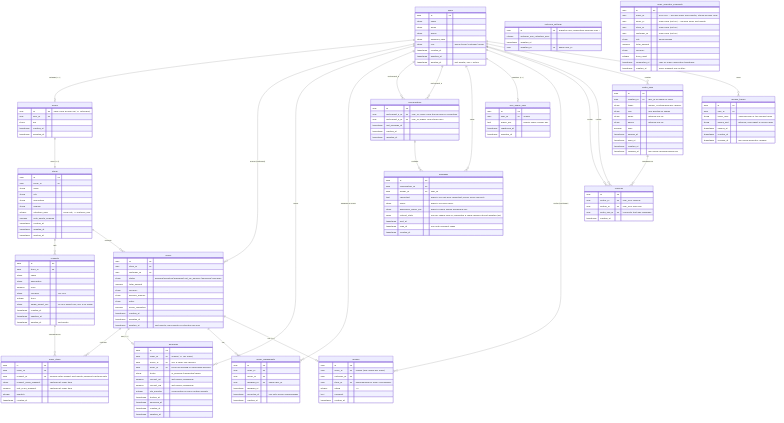
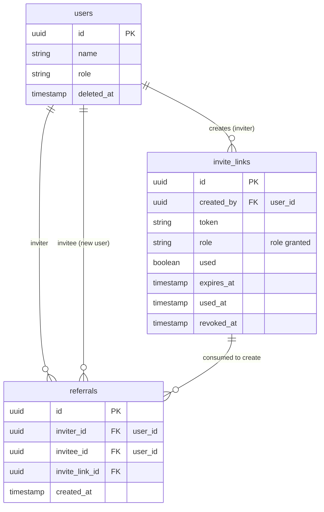

# ER Diagram — Invite-Only Marketplace

> **Phase 1 deliverable.** All table names use plural `snake_case`, PKs are `id` (UUID v4), FKs are `{singular}_id`, timestamps are `created_at` / `updated_at` / `deleted_at` per [PROJECT.md §5.2](../PROJECT.md). No SQL DDL — field lists only. The Database Engineer produces DDL + migrations in Phase 2.

---

## 1. Full Entity-Relationship Diagram

```mermaid
erDiagram
    users {
        uuid id PK
        string name
        string email
        string phone
        string password_hash
        string role "admin|seller|customer|driver"
        timestamp created_at
        timestamp updated_at
        timestamp deleted_at "soft-delete; null = active"
    }

    sellers {
        uuid id PK "same UUID as users.id (1:1 extension)"
        uuid user_id FK
        string bio
        timestamp created_at
        timestamp updated_at
    }

    stores {
        uuid id PK
        uuid seller_id FK
        string name
        string city
        string description
        string address
        integer retention_days "seller-set; >= platform_min"
        boolean auto_delete_enabled
        timestamp created_at
        timestamp updated_at
        timestamp deleted_at
    }

    products {
        uuid id PK
        uuid store_id FK
        string name
        string description
        numeric price
        string currency "ISO 4217"
        integer stock
        string image_object_key "S3/GCS object key; null if no image"
        timestamp created_at
        timestamp updated_at
        timestamp deleted_at "soft-delete"
    }

    orders {
        uuid id PK
        uuid store_id FK
        uuid customer_id FK
        string status "pending|accepted|preparing|out_for_delivery|delivered|cancelled"
        numeric total_amount
        string currency
        string delivery_address
        string notes
        boolean driver_requested
        timestamp created_at
        timestamp updated_at
        timestamp deleted_at "soft-delete; hard-delete by retention job only"
    }

    order_items {
        uuid id PK
        uuid order_id FK
        uuid product_id FK "nullable after product soft-delete; snapshot captures data"
        string product_name_snapshot "captured at order time"
        numeric unit_price_snapshot "captured at order time"
        integer quantity
        timestamp created_at
    }

    deliveries {
        uuid id PK
        uuid order_id FK "unique (1:1 per order)"
        uuid driver_id FK "null if seller self-delivers"
        uuid seller_id FK "seller performing or supervising delivery"
        string status "in_progress|completed|failed"
        numeric current_lat "last known; ephemeral"
        numeric current_lng "last known; ephemeral"
        integer eta_minutes "recalculated on each location update"
        timestamp started_at
        timestamp delivered_at
        timestamp created_at
        timestamp updated_at
    }

    driver_assignments {
        uuid id PK
        uuid order_id FK
        uuid driver_id FK
        uuid assigned_by FK "admin user_id"
        timestamp assigned_at
        timestamp accepted_at "null until driver acknowledges"
        timestamp created_at
    }

    conversations {
        uuid id PK
        uuid participant_a_id FK "user_id; lower UUID stored here by convention"
        uuid participant_b_id FK "user_id; higher UUID stored here"
        timestamp last_message_at
        timestamp created_at
        timestamp updated_at
    }

    messages {
        uuid id PK
        uuid conversation_id FK
        uuid sender_id FK "user_id"
        text ciphertext "base64 AES-256-GCM ciphertext; server never decrypts"
        string nonce "base64 AES-GCM nonce"
        string ephemeral_public_key "base64 X25519 sender ephemeral key"
        jsonb ratchet_state "null for simple X25519; populated if Signal double-ratchet adopted (D2)"
        timestamp sent_at
        timestamp read_at "null until recipient reads"
        timestamp created_at
    }

    user_public_keys {
        uuid id PK
        uuid user_id FK "unique"
        text public_key "base64 X25519 public key"
        timestamp registered_at
        timestamp updated_at
    }

    reviews {
        uuid id PK
        uuid order_id FK "unique (one review per order)"
        uuid customer_id FK
        uuid store_id FK "denormalized for query convenience"
        integer rating "1–5"
        text comment
        timestamp created_at
    }

    referrals {
        uuid id PK
        uuid inviter_id FK "user_id of referrer"
        uuid invitee_id FK "user_id of new user"
        uuid invite_link_id FK "the invite that was consumed"
        timestamp created_at
    }

    invite_links {
        uuid id PK
        uuid created_by FK "user_id of admin or seller"
        string token "unique, cryptographically random"
        string role "role granted on signup"
        string email "optional pre-fill"
        string phone "optional pre-fill"
        boolean used
        timestamp expires_at
        timestamp used_at
        timestamp created_at
        timestamp revoked_at "null unless revoked before use"
    }

    refresh_tokens {
        uuid id PK
        uuid user_id FK
        string token_hash "Argon2id hash of the refresh token"
        string device_hint "optional; user-agent or device label"
        timestamp expires_at
        timestamp created_at
        timestamp revoked_at "null unless explicitly revoked"
    }

    platform_settings {
        uuid id PK "singleton row; application enforces max 1"
        integer platform_min_retention_days
        timestamp updated_at
        uuid updated_by FK "admin user_id"
    }

    order_analytics_snapshots {
        uuid id PK
        uuid order_id "NOT a FK — survives order hard-delete; stored as plain UUID"
        uuid seller_id "plain UUID (not FK) — survives seller soft-delete"
        uuid store_id "plain UUID (not FK)"
        uuid customer_id "plain UUID (not FK)"
        string city "denormalized"
        numeric total_amount
        string currency
        integer item_count
        timestamp completed_at "copy of order completion timestamp"
        timestamp created_at "when snapshot was written"
    }

    %% Relationships
    users ||--o| sellers : "extends (1:1)"
    sellers ||--|| stores : "owns (1:1)"
    stores ||--o{ products : "lists"
    stores ||--o{ orders : "receives"
    users ||--o{ orders : "places (customer)"
    orders ||--o{ order_items : "contains"
    products ||--o{ order_items : "referenced by"
    orders ||--o| deliveries : "has (1:1)"
    users ||--o{ deliveries : "drives"
    orders ||--o{ driver_assignments : "has"
    users ||--o{ driver_assignments : "assigned as driver"
    users ||--o{ conversations : "participant_a"
    users ||--o{ conversations : "participant_b"
    conversations ||--o{ messages : "contains"
    users ||--o{ messages : "sends"
    users ||--o| user_public_keys : "registers (1:1)"
    orders ||--o| reviews : "has (1:1)"
    users ||--o{ reviews : "writes (customer)"
    users ||--o{ referrals : "inviter"
    users ||--o{ referrals : "invitee"
    invite_links ||--o{ referrals : "consumed by"
    users ||--o{ invite_links : "creates"
    users ||--o{ refresh_tokens : "holds"
```

<!-- rendered image -->

---

## 2. Entity Annotations

### users

- Central identity table for all roles. Role tag drives RBAC.
- `deleted_at` soft-delete: profile hidden from non-admin; orders, messages, analytics snapshots retained per retention rules.
- Indexes: `email` (unique), `role`, `deleted_at`.

### sellers

- Extends `users` 1:1; `id = user_id` (same UUID). Avoids nullable role-specific columns on the `users` table.
- Cascade behavior: if user is soft-deleted, the seller record is implicitly inactive; no separate `deleted_at` needed.
- Index: `user_id` (unique).

### stores

- 1:1 with `sellers`. City field gates all downstream product/order queries.
- `retention_days` is seller-configurable but must be `>= platform_settings.platform_min_retention_days` (enforced at write time in the service layer).
- `auto_delete_enabled`: if true, the nightly retention job hard-deletes eligible orders for this store.
- `deleted_at` soft-delete propagates visibility restriction to products and orders.
- Indexes: `seller_id` (unique), `city`, `deleted_at`.

### products

- `image_object_key` stores the S3/GCS key; signed GET URLs are generated on-the-fly (not stored).
- Soft-deleted products still referenced by `order_items` via snapshot columns — the FK to `products` is nullable to allow orphaning on hard-delete (Phase 2 decision).
- Indexes: `store_id`, `deleted_at`, `(store_id, deleted_at)` composite for listing queries.

### orders

- State machine: `pending → accepted → preparing → out_for_delivery → delivered`, with `cancelled` reachable from most states by admin.
- **Soft-delete lifecycle:** `deleted_at` is set only by the retention background job (hard-delete equivalent in logical terms; row removed). Direct soft-delete via cancel sets `status=cancelled`, not `deleted_at`.
- `order_analytics_snapshots` is written atomically with the `delivered` transition (same DB transaction or immediate background task).
- Indexes: `customer_id`, `store_id`, `status`, `created_at` (for retention job date filter).

### order_items

- Snapshot columns (`product_name_snapshot`, `unit_price_snapshot`) capture product data at order time, ensuring order history is accurate after product edits or deletion.
- `product_id` FK: set `ON DELETE SET NULL` so rows survive product hard-delete; snapshot columns remain.
- Index: `order_id`.

### deliveries

- `current_lat` / `current_lng`: last-known position. Not a time-series table — only latest position is stored here. If position history is needed (future), add a `delivery_location_events` table.
- `driver_id` is null when seller self-delivers.
- `(order_id)` unique constraint: one delivery per order.
- Indexes: `order_id` (unique), `driver_id`, `status`.

### driver_assignments

- Audit trail for admin assignment actions. Multiple rows possible if admin reassigns.
- The active assignment is the most recent row for a given `order_id`.
- Indexes: `order_id`, `driver_id`.

### conversations

- Constrained to exactly 2 participants (see architecture.md Q-A3). `(participant_a_id, participant_b_id)` unique constraint; canonical ordering (lower UUID in `participant_a`) enforced at write time.
- Indexes: `participant_a_id`, `participant_b_id`, `(participant_a_id, participant_b_id)` (unique).

### messages

- **Server stores ciphertext only.** `ciphertext`, `nonce`, `ephemeral_public_key` are opaque byte strings (base64 in transport, bytea in DB).
- `ratchet_state` JSONB column: null under X25519+AES-GCM; populated if Signal double-ratchet is adopted (resolves D2 in Phase 6).
- No `deleted_at`: messages are retained per conversation. Bulk deletion follows user data retention rules.
- Indexes: `conversation_id`, `sender_id`, `sent_at` (for cursor pagination).

### user_public_keys

- 1:1 with `users`. `ON CONFLICT DO UPDATE` on `user_id` allows key rotation.
- Index: `user_id` (unique).

### reviews

- Private — not shown publicly. 1:1 with `orders` (unique constraint on `order_id`).
- `store_id` denormalized for efficient `GET /reviews?seller_id=` queries.
- Indexes: `order_id` (unique), `store_id`, `customer_id`.

### referrals

- Join table recording the referral relationship. Immutable after creation.
- `(inviter_id, invitee_id)` unique to prevent duplicates.
- Indexes: `inviter_id`, `invitee_id`, `invite_link_id`.

### invite_links

- `token` is a cryptographically random string (e.g. 32 bytes → 43-char base64url).
- `used` + `used_at`: set atomically with the user INSERT in the signup transaction.
- `revoked_at`: set when admin/seller revokes an unused invite; overrides `used` check.
- Effective validity: `used=false AND revoked_at IS NULL AND expires_at > now()`.
- Indexes: `token` (unique), `created_by`, `expires_at`.

### refresh_tokens

- Server-side storage for token rotation and per-device revocation (see architecture.md Q-A1).
- `token_hash`: Argon2id of the raw refresh token; raw value never stored.
- Nightly job deletes rows where `expires_at < now()`.
- Indexes: `user_id`, `token_hash` (unique), `expires_at`.

### platform_settings

- Singleton: application code enforces at most one row.
- `platform_min_retention_days` gates all seller retention configurations.
- Index: none needed (single row); `id` PK suffices.

### order_analytics_snapshots

- **Append-only. Never soft-deleted or hard-deleted.** This is the mechanism by which lifetime sales figures persist after order row purges.
- FKs to `orders`, `sellers`, `stores`, `users` are intentionally absent — stored as plain UUIDs to prevent cascade effects. The Database Engineer should document this as a deliberate de-normalization.
- `city` is denormalized from `stores.city` at snapshot time.
- Indexes: `seller_id`, `completed_at`, `(seller_id, completed_at)` composite for dashboard aggregation.

---

## 3. Data Persistence After Soft-Delete / Retention Purge

| Data | Survives order purge? | Survives user soft-delete? | Mechanism |
|---|---|---|---|
| Order row | No (hard-deleted by retention job) | No | Retention job + soft-delete |
| Order items | No (cascade with order) | No | FK cascade |
| Lifetime revenue / order count | **Yes** | **Yes** | `order_analytics_snapshots` (plain UUID refs, no FK) |
| Product name / price at order time | **Yes** (in snapshot) | **Yes** | `order_items.product_name_snapshot` + `unit_price_snapshot` |
| Messages | Yes (no retention job for messages in Phase 1) | Yes (soft-delete does not delete messages) | Retention TBD |
| Reviews | Yes (no cascade from order delete) | Yes | `store_id` denormalized; customer_id remains |
| Referral records | **Yes** | **Yes** | Plain UUID refs after user soft-delete |

---

## 4. Referral Graph Subset

The following diagram shows only the entities involved in the invite and referral chain, to aid the admin UI's referral graph visualization.

<!-- rendered image -->

**Graph traversal notes for admin UI:**
- Nodes = `users` rows.
- Edges = `referrals` rows, directed from `inviter_id` → `invitee_id`.
- Edge label = `invite_links.role` (what role was granted).
- Admin query: join `referrals` on `users` twice (inviter, invitee) to build node + edge lists. See `GET /api/v1/admin/referral-graph` in [api-contract.md](api-contract.md).
- Chain depth: currently assumed depth-1 (direct invite only) for product-visibility scoping; the `referrals` table supports arbitrary depth if the Product Manager later enables multi-hop (see architecture.md Q-A2).

---

## 5. Open Questions for Orchestrator Review

1. **Q-E1 — `order_items.product_id` ON DELETE behavior:** This doc recommends `ON DELETE SET NULL` so order history survives product hard-delete (which is currently soft-delete only, but could become hard-delete in a future retention sweep). The Database Engineer should confirm this or prefer a separate `products_archive` table approach. **Proposed resolution:** `SET NULL` with snapshot columns is sufficient for Phase 1.

2. **Q-E2 — `deliveries.current_lat/lng` vs. location history table:** Storing only the last-known position covers the Phase 7 requirements, but delivery duration/route analytics would benefit from a `delivery_location_events` time-series table. Adding it in Phase 7 is a non-breaking migration. **Proposed resolution:** defer to Phase 7; Database Engineer should reserve the extension point.

3. **Q-E3 — `messages` retention / GDPR right-to-erasure:** The current schema has no deletion mechanism for messages. If a user account is deleted and GDPR erasure is requested, message rows remain (only sender_id would be orphaned). The Security Engineer should address this in Phase 6. **Proposed resolution:** add a `deleted_at` column to `messages` in Phase 6; WS gateway and REST endpoints filter soft-deleted messages for non-admin callers.

4. **Q-E4 — `conversations` group support:** The 2-participant constraint is enforced at the application layer, not via a DB constraint. If group messaging is added in a future phase, the schema allows it (remove the unique constraint, add a `conversation_participants` join table). **Proposed resolution:** document constraint in application code comment; do not add DB-level check constraint so the future migration is simpler.

5. **Q-E5 — `seller_sales_rollups` omission:** The nightly analytics rollup table mentioned in architecture.md §5.5 is not included here as an entity because it is either a materialized view (no ORM model needed) or a derived summary that the Database Engineer will decide in Phase 2. **Proposed resolution:** Database Engineer confirms in Phase 2 whether a physical table or a Postgres materialized view is preferred.
