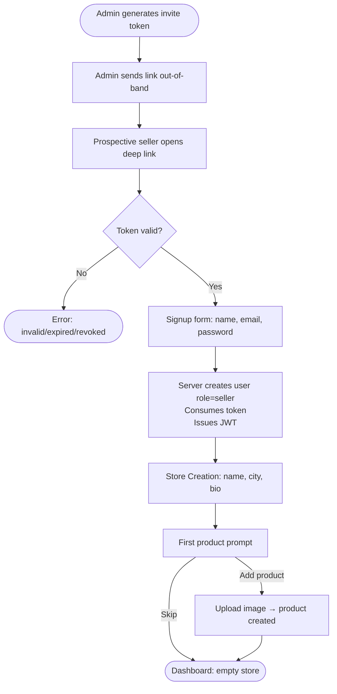
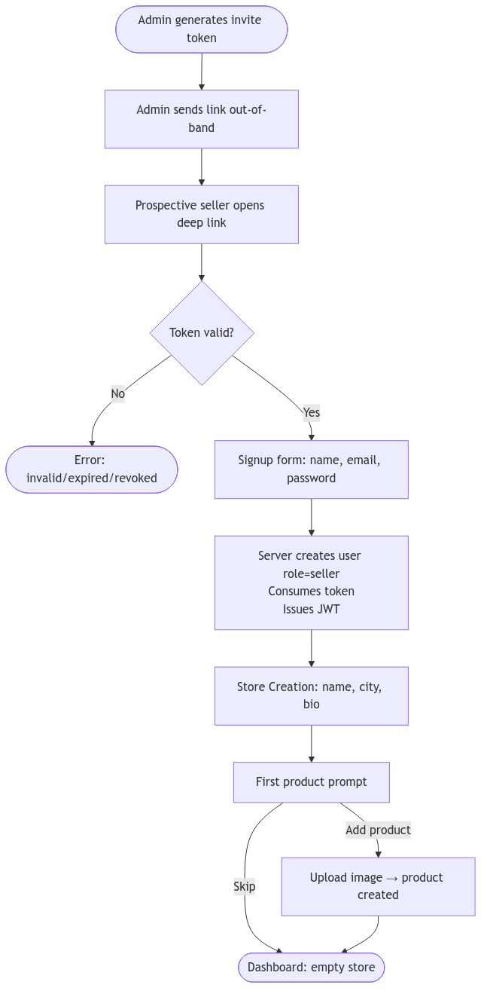
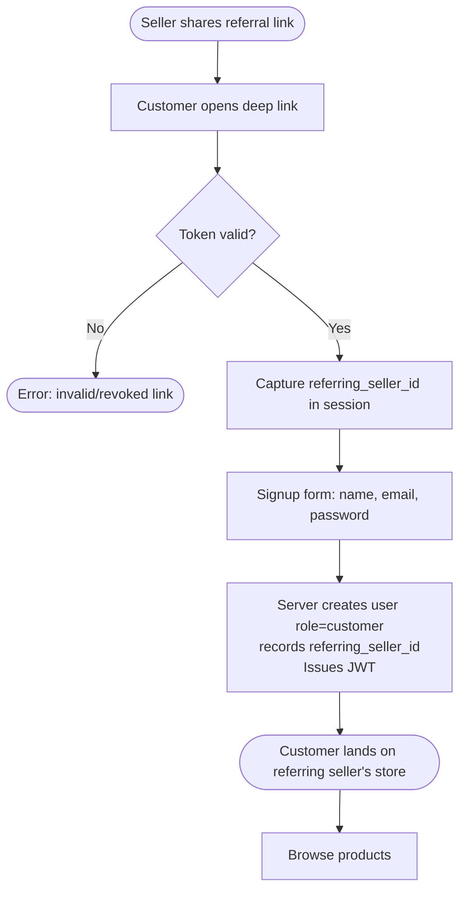
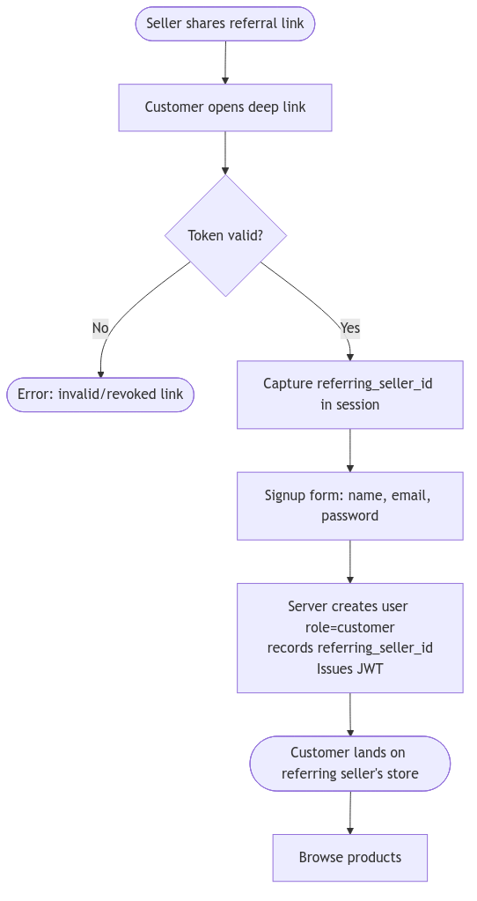
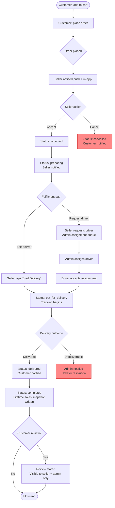
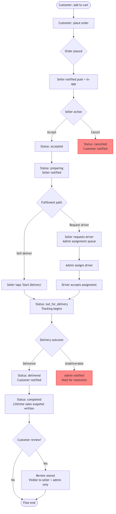
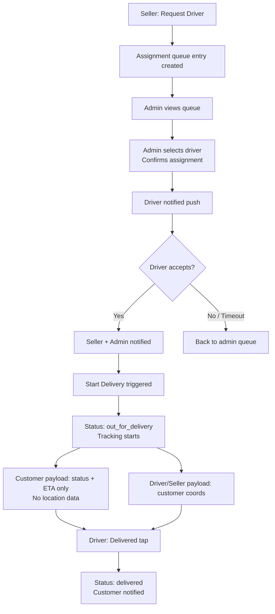
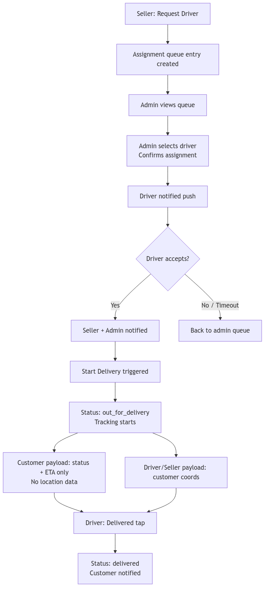

# PRD — Invite-Only Marketplace (v1)

**Phase:** 1 — Product Manager deliverable  
**Status:** Draft for Orchestrator review  
**Last updated:** Phase 1  
**Roles referenced:** `admin`, `seller`, `customer`, `driver` (exact strings from PROJECT.md)

---

## 1. Overview

### 1.1 Problem Statement

Consumer marketplaces optimise for scale at the cost of trust. Any person can sign up as a seller, any person can buy, and the result is an anonymous transaction between strangers. Trust is patched on after the fact with public review scores that are gameable, refund policies that are hard to enforce, and delivery tracking that leaks the locations of everyone in the chain.

This product inverts that model: access is earned, not given. Every participant — seller, customer, and driver — arrives via a vouched invite link. Sellers grow their own customer networks. Customers know whose store they are in. The platform enforces this social graph at the data layer, not just the UI layer.

Three additional problems are solved in v1 alongside access control:

1. **Privacy in delivery.** Existing tracking flows expose driver and seller coordinates to customers, creating safety and competitive-intelligence risks. Our asymmetric tracking model eliminates that exposure without degrading the customer experience.
2. **Message privacy.** Marketplace messages between buyers and sellers pass through platforms that read and monetise them. End-to-end encryption means the server stores only ciphertext; no operator can read the conversation.
3. **Data lifecycle integrity.** Analytics (lifetime sales) must survive order record deletion, and records must not be deleted before a platform-mandated minimum retention window — two rules that most CRUD-first systems handle badly.

### 1.2 Target Users

| Role | Description |
|---|---|
| `admin` | Platform operator. One or more trusted individuals who manage the ecosystem: issue invites, moderate users, assign drivers, set platform configuration. |
| `seller` | A city-based merchant with a single storefront. Grows their own customer base through referral links. Manages products, fulfils orders (self or via driver). |
| `customer` | A vouched buyer, introduced by a specific seller. Browses and orders exclusively from the seller who invited them (in v1). |
| `driver` | A delivery agent assigned by admin to specific orders. Has limited app surface: accepts jobs, marks delivery milestones, sees customer coordinates only during active delivery. |

### 1.3 Value Proposition

- **Trust by construction.** Every account is traceable to a human invite chain. Bad actors can be removed and their downstream access revoked.
- **Privacy-first delivery tracking.** Customers track their order status and ETA without seeing anyone's location. Sellers and drivers operate without exposing coordinates to the customer.
- **End-to-end encrypted messaging.** Conversations between customer and seller are private even from the platform operator.
- **Durable seller analytics.** Lifetime sales figures persist independently of order or product deletion, giving sellers reliable business intelligence.
- **Seller-owned growth.** Sellers issue their own referral links. Their customer network is theirs.

### 1.4 Key Differentiators

| Differentiator | How it works in this product |
|---|---|
| Invite-only trust model | Two-tier invite graph: admin issues invites to sellers; sellers issue referral links to customers. No anonymous signup. |
| Seller-scoped browsing | Customers see only the store of the seller who invited them (v1 constraint). Scoping is enforced server-side. |
| Asymmetric delivery visibility | When an order is `out_for_delivery`, the server enforces: driver/seller location data is never included in the customer-facing delivery payload. |
| E2E encrypted messaging | X25519 key exchange + AES-256-GCM. Server stores ciphertext only. Keys live on client devices. |
| Retention-safe analytics | Lifetime sales are snapshotted at `completed` time and stored in a separate analytics ledger. Order row deletion does not affect them. |
| Private reviews | Reviews are visible only to the reviewed seller and admins. No public reputation system in v1. |

### 1.5 Non-Goals for v1

The following are explicitly out of scope for the v1 MVP. They may be revisited in Phase 14 (iteration).

- **Multi-seller browsing for customers.** Customers are scoped to one seller in v1. Cross-seller discovery is a future feature.
- **Public review display.** Reviews are private. No star ratings, no public profiles.
- **Driver ↔ customer messaging.** Messaging in v1 is customer ↔ seller only. Driver communication is handled out-of-band.
- **Customer ↔ customer messaging.** Not applicable; out of scope.
- **In-app payments / payment processing.** Payment is handled outside the platform in v1. The order model records intent; payment settlement is offline.
- **Promotions, coupons, or dynamic pricing.** Sellers set fixed prices per product.
- **Multi-city seller accounts.** One store, one city.
- **Native map rendering in delivery tracking.** v1 shows status + ETA only; no map view for the customer (map UI is Phase 10 work, subject to open decision D4).
- **Signal-protocol double-ratchet messaging.** v1 ships X25519 + AES-256-GCM. Ratchet is a future upgrade (open decision D2).
- **Self-serve driver signup.** Drivers are created and managed by admin only.
- **Automated driver assignment.** Admin manually assigns drivers in v1.

---

## 2. Personas

### admin

The admin is the platform operator — typically the founder or a small trusted ops team. Their primary goal is ecosystem health: they want the network to grow (more sellers, more customers) while keeping bad actors out. Frustrations include noise from manual driver-assignment requests, difficulty seeing the referral graph when the network grows large, and the risk that a seller issues referral links carelessly and introduces untrusted users. Success for the admin means: no unvetted accounts exist in the system, every driver assignment is completed within 30 minutes of a seller request, and no data-retention policy violations occur. The admin surface must surface the referral graph, a moderation queue, an assignment queue, and platform configuration levers in a single, low-latency workflow.

### seller

The seller is a city-based merchant who has been personally invited by the admin. Their goal is to run a profitable, low-friction storefront: add products, share their referral link to grow their customer base, fulfil orders quickly (by delivering themselves or requesting a driver), and track their business performance via lifetime sales figures. Frustrations include: not knowing which customers came from which invite, losing analytics when old orders are cleaned up, and waiting too long for admin to assign a driver. Success for the seller means: a customer can place an order within 60 seconds of landing on the store, the seller can accept and begin fulfilment without switching apps, and their lifetime sales dashboard is always accurate regardless of what records have been deleted.

### customer

The customer is a trusted buyer, vouched for by a specific seller via a referral link. Their goal is frictionless discovery and ordering from the seller they trust, with the confidence that their personal conversations and delivery whereabouts are private. Frustrations include: not knowing the real status of a delivery, messages that might be read by the platform, and feeling locked into a relationship they want to end cleanly (account deletion should be fast and complete). Success for the customer means: order placed in under 3 taps after browsing, delivery status updates arrive within 10 seconds of a seller action, and no personal data outlives their explicit deletion request beyond the platform minimum retention window.

### driver

The driver is a delivery agent whose account is created and managed entirely by admin. Their goal is to receive clear job assignments, navigate to pickup and drop-off locations, and close jobs quickly. Frustrations include: receiving vague delivery addresses, having to confirm job acceptance through a slow UI, and not knowing how many deliveries they have completed. Success for the driver means: a new assignment appears in the app within 5 seconds of admin assignment, the delivery address is clear and accurate, and they can mark stages (out_for_delivery, delivered) with a single tap.

---

## 3. User Flows

### 3.1 Seller Onboarding (Invite-Only)

**Prerequisites:** admin exists; invite token is valid and not yet consumed.

1. Admin generates a seller invite token (single-use, expiry configurable).
2. Admin delivers the invite link out-of-band (e.g. SMS, email) to the intended seller.
3. Prospective seller opens the deep link (`/invite/{token}`).
4. App validates the token server-side.
   - **[Token invalid / expired / revoked]** → Show error screen. Flow ends.
   - **[Token valid]** → Continue.
5. Signup form displayed: name, email, password.
6. On submit, server creates user with `role=seller`, consumes (marks used) the token, and issues JWT access + refresh tokens.
7. Post-auth, seller is directed to **Store Creation** wizard:
   - Enter store name, city (from allowed list or free text), and bio.
   - Submit → `stores` record created, linked to seller.
8. Seller is prompted to add their first product (name, description, price, image).
   - Image upload → signed URL from object storage → product record created.
   - **[Skip]** → Seller lands on dashboard with empty product list and a prompt to add products.
9. Seller dashboard shown: lifetime sales (0), active orders (0), referral link displayed.



<!-- rendered image -->



### 3.2 Customer Onboarding (Invite-Only)

**Prerequisites:** seller exists and has their unique referral link.

1. Seller shares their referral link (`/ref/{seller_id}/{token}`) with a prospective customer.
2. Prospective customer opens the deep link.
3. App validates the referral token server-side.
   - **[Token invalid / revoked]** → Error screen. Flow ends.
   - **[Token valid]** → Continue. The `seller_id` encoded in the link is captured in session.
4. Signup form displayed: name, email, password.
5. On submit, server creates user with `role=customer`, records `referring_seller_id` on the user record, consumes the referral token (or decrements use-count if multi-use referral tokens are supported — see Open Questions §9.1).
6. Customer is issued JWT access + refresh tokens and lands directly on the referring seller's store.
7. Customer browses products; all subsequent product/order API calls are scoped to `referring_seller_id`.



<!-- rendered image -->



### 3.3 Admin Management Flows

#### 3.3.1 Invite Issuing

1. Admin opens Invite Management panel.
2. Selects invite type: **seller invite** (admin-only) or reviews seller referral links (read-only; sellers manage their own).
3. Configures expiry duration (default: platform setting) and optional one-use vs. multi-use flag.
4. Generates token → link displayed + copy button.
5. Admin distributes link out-of-band.

#### 3.3.2 User Moderation (Disable / Enable)

1. Admin opens User Management panel; list of all `seller`, `customer`, `driver` accounts.
2. Selects a user → User Detail view.
3. **Disable:** Admin taps "Disable account".
   - Server sets `disabled_at` timestamp on the user.
   - All active JWT sessions for that user are invalidated (refresh tokens revoked).
   - If user is a seller: their store becomes invisible to customers; active orders in `placed` or `accepted` state are flagged for admin review.
   - If user is a customer: their active orders are flagged.
4. **Enable:** Admin taps "Enable account". `disabled_at` cleared; user can log in again.

#### 3.3.3 Driver Assignment

1. Seller requests a driver (see §3.5). A request appears in the admin **Assignment Queue**.
2. Admin views queue: order ID, seller name, city, time elapsed since request.
3. Admin selects a driver from available driver accounts.
4. Admin confirms assignment → `driver_id` written to the order, order status remains `preparing` until seller/driver starts delivery.
5. Driver receives push notification of new assignment.

#### 3.3.4 Platform Settings

Configurable by admin:

- **Minimum data retention period** (integer, days). No order may be deleted before this many days after `completed_at`.
- **Seller auto-delete default** (boolean). Whether new sellers default to auto-delete enabled.
- **Invite token default expiry** (hours).

#### 3.3.5 Referral Graph Audit

1. Admin opens Referral Graph view.
2. Graph displays: admin → seller nodes; seller → customer nodes; edges labelled with invite date.
3. Admin can click a node to view that user's detail and moderation actions.
4. Admin can filter by city, date range.

### 3.4 Order Lifecycle

**State machine:** `placed` → `accepted` → `preparing` → `out_for_delivery` → `delivered` → `completed`

**Also supported:** `cancelled` (terminal); refund acknowledgement recorded on the order.



<!-- rendered image -->



#### Cancellation Branch

- Customer can cancel while status is `placed` (before `accepted`).
- Seller can cancel while status is `placed` or `accepted`.
- Admin can cancel at any status except `completed`.
- On cancellation: order moves to `cancelled`, both parties notified.

#### Refund Branch

- No in-app payment in v1; refund is an acknowledgement record only.
- Admin marks refund as processed on a `cancelled` or `delivered` order.
- Refund status is visible to the affected customer and seller.

#### Retention / Deletion

- Orders in `completed` state may be deleted only after `completed_at` + platform minimum retention days.
- Seller may enable auto-delete; system enforces the floor.
- Lifetime-sales analytics snapshot is written at `completed` time and is never deleted by order cleanup.

### 3.5 Delivery Assignment

1. Seller, on an `accepted` or `preparing` order, chooses "Request Driver" (vs. "Start Delivery").
2. Seller request is recorded; order status remains unchanged; admin assignment queue gains an entry.
3. Admin sees the queue entry (order ID, seller, city, time waiting).
4. Admin selects an available driver and confirms.
5. Order gains `driver_id`; driver receives push notification.
6. Driver opens app → sees assigned order with pickup address and customer drop-off address.
7. Driver taps "Accept" → confirmation sent to seller and admin.
8. Seller (or driver, depending on flow — see Open Question §9.2) taps "Start Delivery" → status moves to `out_for_delivery`.
9. Tracking begins:
   - **Driver/seller** can see customer coordinates.
   - **Customer** payload contains: `status`, `eta_minutes`, `driver_first_name` only. No coordinates, no seller location.
10. Driver taps "Delivered" → status moves to `delivered`; customer notified.
11. Admin or seller marks `completed` (see §3.4 for full completed flow).

Metrics captured at each stage: `out_for_delivery_at`, `delivered_at`, delivery duration.



<!-- rendered image -->



### 3.6 Messaging

**v1 scope:** customer ↔ seller only. One conversation per (customer, seller) pair.

1. Customer taps "Message Seller" on any product or order screen.
2. App checks: does a conversation record exist for (customer_id, seller_id)?
   - **No** → Server creates conversation record; client generates ephemeral session key using X25519 key exchange (seller's public key retrieved from server).
   - **Yes** → Load existing conversation; client re-derives session key from stored key material.
3. Customer types a message; client encrypts plaintext with AES-256-GCM using the session key.
4. Ciphertext is sent to server. Server stores ciphertext only — no plaintext ever written to DB.
5. Server fans out via WebSocket (Redis pub/sub) to the seller's connected session.
6. Seller's client receives ciphertext, decrypts locally, displays plaintext.
7. Seller replies; same encrypt → send → store-ciphertext → fan-out → decrypt flow.
8. Read receipts: when recipient's client receives and decrypts, it sends a `read` event. Server records `read_at` on the message record (timestamp only; not the content).
9. Unread count badges updated via WebSocket.

**Retention alignment:** messages may not be deleted before the platform minimum retention period. The deletion timestamp on a conversation respects the same floor as orders.

**Offline behaviour:** if recipient's WebSocket is closed, message is held in the Redis message queue and delivered on reconnect. Push notification is sent (payload: "You have a new message" — no message content in the push payload, to preserve E2E guarantees).

### 3.7 Reviews (Private)

1. When an order reaches `completed`, the customer is prompted in-app: "Leave a review for [seller name]?".
2. Review form: star rating (1–5) and optional text (max 1000 characters).
3. On submit: review record created, linked to `order_id`, `customer_id`, `seller_id`.
4. Review is visible to:
   - The seller (in their dashboard, linked to the order).
   - Any `admin`.
   - Not to the public; not to other customers.
5. One review per order. A review, once submitted, cannot be edited in v1.
6. Seller cannot see the review until after the status is `completed` (no pre-completion influence).

---

## 4. Features & Prioritization

| # | Feature | Description | Priority | Depends on | Phase |
|---|---|---|---|---|---|
| F01 | Admin invite issuance | Admin generates single-use, expiring invite tokens for sellers | P0 | Auth | 3 |
| F02 | Seller referral links | Each seller has a unique referral link (or token) to onboard customers | P0 | Auth, F01 | 3 |
| F03 | Invite token validation | Server validates token: not expired, not used, not revoked | P0 | F01, F02 | 3 |
| F04 | Invite token revocation | Admin can revoke any outstanding invite or referral token | P0 | F01, F02 | 3 |
| F05 | JWT auth + refresh | Short-lived access token (15 min) + rotating refresh (7 days); secure storage on device | P0 | — | 3 |
| F06 | RBAC — role enforcement | All API endpoints enforce role; role assigned at signup from invite type | P0 | F05 | 3 |
| F07 | Role selection at signup | If invite type allows multiple roles (future), user selects role; in v1 role is determined by invite type | P0 | F05, F06 | 3 |
| F08 | Seller store creation | Seller creates one store: name, city, bio; one store per seller enforced | P0 | F06 | 4 |
| F09 | Product CRUD | Seller creates, reads, updates, deletes products (name, desc, price, image) | P0 | F08 | 4 |
| F10 | Product image upload | Image upload to object storage (S3/GCS); signed URL for retrieval | P0 | F09 | 4 |
| F11 | Customer browsing scoped | Customer browses only the referring seller's products; enforced server-side | P0 | F02, F06, F09 | 4 |
| F12 | Cart management | Customer adds/removes items from cart; cart persisted server-side (or device-side — see Open Question §9.3) | P0 | F11 | 5 |
| F13 | Order placement | Customer submits cart as an order; order record created in `placed` state | P0 | F12 | 5 |
| F14 | Order lifecycle state machine | Server enforces valid transitions: placed → accepted → preparing → out_for_delivery → delivered → completed; + cancelled | P0 | F13 | 5 |
| F15 | Seller order accept/cancel | Seller accepts or cancels a `placed` order | P0 | F14 | 5 |
| F16 | Self-delivery path | Seller taps "Start Delivery" on an accepted/preparing order; moves to out_for_delivery without driver | P0 | F14 | 5 |
| F17 | Driver request | Seller requests driver from admin for a specific order | P0 | F14 | 5 |
| F18 | Admin driver assignment | Admin assigns a driver to a pending request; driver notified | P0 | F17, Driver accounts | 5 |
| F19 | Driver account management | Admin creates/disables driver accounts; drivers cannot self-register | P0 | F06 | 3 |
| F20 | Asymmetric delivery tracking | Customer delivery payload: status + ETA only. Driver/seller payload: customer coordinates. Never reversed. | P0 | F14, F16/F18 | 7 |
| F21 | E2E messaging (customer↔seller) | X25519 key exchange; AES-256-GCM encryption; server stores ciphertext only; WebSocket delivery | P0 | F05, F06 | 6 |
| F22 | Message read receipts | Server records read_at timestamp on message; no plaintext stored | P0 | F21 | 6 |
| F23 | Private reviews | Customer leaves post-completion review (1–5 stars + text); visible to seller + admin only | P0 | F14 | 5 |
| F24 | Admin user moderation | Admin can disable/enable any seller, customer, or driver; JWT sessions invalidated on disable | P0 | F05, F06 | 3 |
| F25 | Admin platform settings | Admin sets: minimum retention period (days), invite default expiry, seller auto-delete default | P0 | F06 | 3 |
| F26 | Data retention enforcement | Orders deletable only after completed_at + platform minimum days; seller auto-delete respects floor | P0 | F14, F25 | 5 |
| F27 | Lifetime sales analytics | Snapshot written at completed time to analytics ledger; never deleted by order cleanup | P0 | F14 | 5 |
| F28 | Seller dashboard | Shows lifetime sales, active orders, referral link; real-time updates via WebSocket | P0 | F09, F14, F27 | 8/9 |
| F29 | Admin referral graph | Visual graph of admin → seller → customer invite relationships; filterable by city, date | P1 | F01, F02 | 11 |
| F30 | Push notifications — order events | Push on: order placed (seller), accepted/cancelled (customer), out_for_delivery (customer), delivered (customer), driver assigned (driver) | P1 | F14, F18 | 9 |
| F31 | Push notifications — messages | Push on new message received (when WebSocket offline); payload contains no message content | P1 | F21 | 9 |
| F32 | In-app notifications | In-app bell / badge for all notification events; reads cleared per user | P1 | F30, F31 | 9 |
| F33 | Search / filter within seller store | Customer searches products by keyword within the referring seller's store; optional category/price filter | P1 | F11 | 4 |
| F34 | Refund acknowledgement | Admin marks refund processed on cancelled/delivered order; status visible to customer and seller | P1 | F14, F15 | 5 |
| F35 | Customer account deletion | Customer requests deletion; data deleted/anonymised per retention rules; confirmation email | P1 | F26 | 3 |
| F36 | Seller auto-delete configuration | Seller enables/disables auto-delete for their completed orders; setting respects platform floor | P1 | F25, F26 | 5 |
| F37 | Offline message queue | Messages queued on device when WebSocket offline; sent on reconnect; no data loss | P1 | F21 | 6 |
| F38 | Order view cached offline | Customer and seller can view last-known order state when offline (read-only) | P1 | F14 | 9 |
| F39 | Driver ↔ customer messaging | Driver can message customer during active delivery | P2 | F21 | Post-MVP |
| F40 | Multi-seller browsing | Customer browses products from multiple sellers | P2 | F11 | Post-MVP |
| F41 | Public reviews | Reviews visible to all customers | P3 | F23 | Future |
| F42 | Automated driver assignment | System auto-assigns driver based on proximity or load | P3 | F18, F20 | Future |
| F43 | In-app payments | Payment processing within the app | P3 | F13 | Future |
| F44 | Promotions / coupons | Discount codes, seller promotions | P3 | F09, F13 | Future |
| F45 | Multi-city seller accounts | One seller can operate stores in multiple cities | P3 | F08 | Future |
| F46 | Signal double-ratchet E2E | Forward secrecy and break-in recovery for messaging | P3 | F21, D2 resolved | Future |

---

## 5. Acceptance Criteria

All P0 and P1 features have Gherkin-style acceptance criteria below. Features are grouped by domain.

---

### 5.1 Invite System (F01–F04)

**F01 — Admin invite issuance**

```gherkin
Scenario: Admin issues a valid seller invite
  Given the user is authenticated as admin
  When the admin requests a seller invite with expiry=48h
  Then a unique single-use token is returned
  And the token is stored in the DB with status=pending and expires_at set correctly

Scenario: Non-admin cannot issue invites
  Given the user is authenticated as seller or customer or driver
  When the user attempts to call the invite generation endpoint
  Then the server returns HTTP 403

Scenario: Invite token expiry
  Given an invite token with expiry=1h was issued
  When the token is used more than 1 hour after issuance
  Then the server returns a 400 error with reason="token_expired"
  And no account is created

Scenario: Invite token reuse
  Given an invite token has been successfully consumed (status=used)
  When a second user attempts to use the same token
  Then the server returns a 400 error with reason="token_already_used"
  And no second account is created

Scenario: Invite token revocation by admin
  Given an invite token with status=pending exists
  When the admin revokes the token
  Then the token status is set to revoked
  And any subsequent use of that token returns 400 with reason="token_revoked"
  And no account is created
```

**F02 — Seller referral links**

```gherkin
Scenario: Seller referral link is unique per seller
  Given a seller account exists
  When the seller views their dashboard
  Then exactly one referral link is shown, containing the seller's ID

Scenario: Referral link creates customer with correct referring_seller_id
  Given a valid seller referral link for seller_id=X
  When a new customer signs up via that link
  Then the customer user record has referring_seller_id=X
  And the customer is directed to seller X's store on first login
```

**F03 — Invite token validation**

```gherkin
Scenario: Valid token allows signup
  Given an invite token with status=pending and not expired
  When a user submits the signup form with that token
  Then the account is created with the correct role
  And the token status is updated to used

Scenario: Tampered token is rejected
  Given a token string that does not correspond to any record in the DB
  When a user attempts to sign up with that token
  Then the server returns 400 with reason="token_invalid"
```

---

### 5.2 Auth + RBAC (F05–F07)

**F05 — JWT auth + refresh**

```gherkin
Scenario: Access token expires after 15 minutes
  Given a user is issued an access token at time T
  When the user presents that token at time T+16min
  Then the server returns HTTP 401 with reason="token_expired"

Scenario: Refresh token rotation on use
  Given a user has a valid refresh token
  When the user requests a new access token using the refresh token
  Then a new access token and a new refresh token are issued
  And the old refresh token is invalidated

Scenario: Refresh token expires after 7 days
  Given a refresh token was issued at time T
  When the user attempts to refresh at time T+8days
  Then the server returns HTTP 401 and the user must re-authenticate

Scenario: Refresh token invalidated on disable
  Given a user account is disabled by admin
  When the disabled user attempts to use their refresh token
  Then the server returns HTTP 401
  And no new access token is issued
```

**F06 — RBAC enforcement**

```gherkin
Scenario: Customer cannot access seller-only endpoints
  Given the user is authenticated as customer
  When the user calls a seller-only endpoint (e.g. product create)
  Then the server returns HTTP 403

Scenario: Driver cannot access admin endpoints
  Given the user is authenticated as driver
  When the user calls an admin-only endpoint
  Then the server returns HTTP 403
```

---

### 5.3 Seller Store + Product CRUD (F08–F10)

**F08 — Seller store creation**

```gherkin
Scenario: Seller can create exactly one store
  Given a seller account with no existing store
  When the seller submits a valid store creation request (name, city, bio)
  Then a store record is created linked to the seller

Scenario: Seller cannot create a second store
  Given a seller account with an existing store
  When the seller attempts to create another store
  Then the server returns HTTP 409 with reason="store_already_exists"
```

**F09 — Product CRUD**

```gherkin
Scenario: Seller creates a product
  Given the seller has an existing store
  When the seller submits a valid product (name, description, price > 0, image)
  Then the product is created and associated with the seller's store

Scenario: Seller updates a product
  Given a product exists for this seller
  When the seller submits valid updated fields
  Then the product record reflects the changes

Scenario: Seller deletes a product
  Given a product exists for this seller
  And the product has no active orders in placed/accepted/preparing/out_for_delivery state
  When the seller deletes the product
  Then the product record is soft-deleted (not visible to customers)
  And historical order line items still reference the product name and price (denormalised)

Scenario: Seller cannot delete a product with active orders
  Given a product has an order in state accepted
  When the seller attempts to delete the product
  Then the server returns HTTP 409 with reason="product_has_active_orders"
```

**F10 — Product image upload**

```gherkin
Scenario: Valid image upload
  Given the seller requests a signed upload URL
  When the seller uploads a JPEG or PNG under 10 MB to the signed URL
  Then the product image_url is set and accessible via a signed retrieval URL

Scenario: Oversized image is rejected
  Given the seller requests a signed upload URL
  When the upload is a file exceeding 10 MB
  Then the server returns HTTP 400 with reason="image_too_large"
```

---

### 5.4 Customer Browsing (F11, F33)

**F11 — Customer browsing scoped to referring seller**

```gherkin
Scenario: Customer views only referring seller's products
  Given customer C has referring_seller_id=S1
  When C requests the product listing
  Then only products belonging to seller S1's store are returned

Scenario: Customer cannot view another seller's products
  Given customer C has referring_seller_id=S1
  And seller S2 exists with products
  When C constructs a request for seller S2's product listing
  Then the server returns HTTP 403 with reason="seller_scope_violation"

Scenario: Customer cannot place order with seller they are not linked to
  Given customer C has referring_seller_id=S1
  When C attempts to place an order containing products from seller S2
  Then the server returns HTTP 403 with reason="seller_scope_violation"
```

**F33 — Search / filter within seller store**

```gherkin
Scenario: Keyword search returns matching products
  Given customer C is browsing seller S1's store with 20 products
  When C searches for "bread"
  Then only products with "bread" in name or description are returned

Scenario: Price filter applied
  Given customer C is browsing seller S1's store
  When C filters by max_price=10.00
  Then only products with price <= 10.00 are returned
```

---

### 5.5 Cart + Order Placement (F12–F13)

**F12 — Cart management**

```gherkin
Scenario: Customer adds an item to cart
  Given customer C is viewing a product with sufficient stock
  When C adds the product with quantity=2
  Then the cart contains 2 units of that product

Scenario: Customer removes an item from cart
  Given the cart contains product P
  When C removes P
  Then the cart no longer contains P and the item count decreases

Scenario: Cart is preserved across sessions
  Given C adds items to cart and closes the app
  When C reopens the app and authenticates
  Then the same cart items are present (server-persisted or device-persisted — consistent with §9.3 resolution)
```

**F13 — Order placement**

```gherkin
Scenario: Customer places a valid order
  Given cart contains at least one product from referring seller
  When C submits the order
  Then an order record is created in state placed
  And seller is notified (push + in-app)
  And the cart is cleared

Scenario: Empty cart cannot be checked out
  Given the cart is empty
  When C attempts to place an order
  Then the server returns HTTP 400 with reason="cart_empty"
```

---

### 5.6 Order Lifecycle (F14–F18)

**F14 — State machine**

```gherkin
Scenario: Valid state transitions succeed
  Given an order in state placed
  When seller transitions it to accepted
  Then order status=accepted and seller is notified

Scenario: Invalid state transition is rejected
  Given an order in state completed
  When any actor attempts to transition it to accepted
  Then the server returns HTTP 409 with reason="invalid_state_transition"

Scenario: Cancelled order cannot be reactivated
  Given an order in state cancelled
  When any actor attempts any further state transition
  Then the server returns HTTP 409 with reason="invalid_state_transition"
```

**F15 — Seller accept/cancel**

```gherkin
Scenario: Seller accepts placed order within 30 minutes
  Given order O is in state placed
  When seller accepts O within 30 minutes of placement
  Then status becomes accepted and customer is notified

Scenario: Seller cancels a placed order
  Given order O is in state placed
  When seller cancels O
  Then status becomes cancelled and customer is notified

Scenario: Customer cancels a placed order (before acceptance)
  Given order O is in state placed
  When customer cancels O
  Then status becomes cancelled and seller is notified

Scenario: Customer cannot cancel an accepted order
  Given order O is in state accepted
  When customer attempts to cancel O
  Then the server returns HTTP 409 with reason="cancellation_window_closed"
```

**F16 — Self-delivery path**

```gherkin
Scenario: Seller starts self-delivery
  Given order O is in state preparing and no driver is assigned
  When seller taps "Start Delivery"
  Then order status becomes out_for_delivery
  And out_for_delivery_at timestamp is recorded
  And customer is notified
```

**F17 — Driver request**

```gherkin
Scenario: Seller requests a driver
  Given order O is in state preparing
  When seller requests a driver
  Then a driver_request record is created for O
  And the request appears in the admin assignment queue

Scenario: Seller cannot request a driver if one is already assigned
  Given order O already has driver_id set
  When seller attempts another driver request for O
  Then the server returns HTTP 409 with reason="driver_already_assigned"
```

**F18 — Admin driver assignment**

```gherkin
Scenario: Admin assigns a driver to a request
  Given a driver_request exists for order O
  And driver D is available (not assigned to another active delivery)
  When admin assigns D to O
  Then O.driver_id=D and driver D is notified via push
  And seller is notified that a driver was assigned

Scenario: Admin cannot assign a driver to an order with no pending request
  Given order O has no driver_request record
  When admin attempts to assign a driver
  Then the server returns HTTP 400 with reason="no_driver_request"
```

---

### 5.7 Asymmetric Delivery Tracking (F20)

```gherkin
Scenario: Customer delivery payload contains no location data
  Given order O is in state out_for_delivery
  When the customer polls or receives a WebSocket update for O
  Then the payload contains: order_id, status, eta_minutes, driver_first_name
  And the payload does NOT contain: driver_lat, driver_lng, seller_lat, seller_lng,
      driver_id (full), any coordinate-derived field

Scenario: Driver payload contains customer coordinates
  Given order O is in state out_for_delivery
  When the driver polls the order
  Then the payload contains: customer delivery address coordinates

Scenario: Customer cannot reach driver-location endpoint
  Given order O is in state out_for_delivery
  When customer calls the driver-location endpoint for O
  Then the server returns HTTP 403

Scenario: After delivery is completed, location data is cleared
  Given order O transitions to delivered
  Then any ephemeral location data for that delivery is purged from Redis within 60 seconds
```

---

### 5.8 E2E Messaging (F21–F22, F37)

```gherkin
Scenario: Server never stores plaintext
  Given customer C sends a message to seller S
  When the message is persisted to the DB
  Then only the ciphertext blob is stored
  And no plaintext field exists in the messages table

Scenario: Recipient decrypts message successfully
  Given customer C has encrypted a message using seller S's public key
  When seller S receives the ciphertext via WebSocket
  Then seller S's client decrypts it to the original plaintext using S's private key

Scenario: Read receipt recorded without content
  Given seller S has received and decrypted a message
  When S's client sends a read receipt
  Then the server records read_at timestamp on the message record
  And no plaintext is included in the read receipt payload

Scenario: Message queued for offline recipient
  Given seller S is offline (WebSocket disconnected)
  When customer C sends a message
  Then the message is stored in the queue
  And a push notification is sent to S with payload containing only "You have a new message" (no message content)
  When S reconnects
  Then all queued messages are delivered in order

Scenario: Messages cannot be deleted before retention floor
  Given the platform minimum retention period is 30 days
  And a conversation has messages with the oldest message at T
  When a deletion of the conversation is requested at T+20days
  Then the server returns HTTP 409 with reason="retention_period_not_elapsed"
```

---

### 5.9 Private Reviews (F23)

```gherkin
Scenario: Customer can leave one review per completed order
  Given order O is in state completed for customer C and seller S
  When C submits a review (rating=4, text="Great service")
  Then a review record is created linked to O, C, S

Scenario: Customer cannot leave a second review for the same order
  Given a review already exists for order O and customer C
  When C attempts to submit another review for O
  Then the server returns HTTP 409 with reason="review_already_exists"

Scenario: Review is not visible to other customers
  Given review R exists for order O (seller S, customer C)
  When any other customer calls the reviews endpoint for seller S
  Then HTTP 403 is returned

Scenario: Review is visible to the seller
  Given review R exists for order O (seller S)
  When seller S calls their reviews endpoint
  Then review R is included in the response

Scenario: Review is visible to admin
  Given review R exists
  When admin calls the reviews endpoint for seller S
  Then review R is included in the response

Scenario: Customer cannot review before order is completed
  Given order O is in state delivered (not yet completed)
  When C attempts to submit a review for O
  Then the server returns HTTP 409 with reason="order_not_completed"
```

---

### 5.10 Admin Moderation (F24–F25)

```gherkin
Scenario: Admin disables a seller account
  Given seller S has an active account with active JWT sessions
  When admin disables S
  Then S.disabled_at is set
  And all of S's refresh tokens are revoked
  And S's store is hidden from customers
  And S cannot authenticate until re-enabled

Scenario: Admin re-enables a seller account
  Given seller S is disabled
  When admin enables S
  Then S.disabled_at is cleared
  And S can authenticate normally and their store is visible again

Scenario: Admin sets minimum retention period
  Given admin sets platform_minimum_retention_days=30
  When any seller or system process attempts to delete an order completed fewer than 30 days ago
  Then the server returns HTTP 409 with reason="retention_period_not_elapsed"
```

---

### 5.11 Data Retention + Lifetime Sales (F26–F27)

```gherkin
Scenario: Lifetime sales persist after order deletion
  Given seller S has completed 10 orders with a total value of $1000
  And all 10 orders are eligible for deletion and are deleted
  When seller S views their lifetime sales dashboard
  Then lifetime_sales shows $1000 (sourced from the analytics ledger, not the orders table)

Scenario: Seller cannot delete order before retention floor
  Given platform_minimum_retention_days=30
  And order O has completed_at=T
  When seller requests deletion of O at T+15days
  Then the server returns HTTP 409 with reason="retention_period_not_elapsed"
  And the order is not deleted

Scenario: Seller can delete order after retention floor
  Given order O has completed_at=T and retention floor is 30 days
  When seller requests deletion of O at T+31days
  Then the order record is soft-deleted
  And the analytics ledger entry for O is retained
  And seller dashboard still shows correct lifetime sales
```

---

### 5.12 Notifications (F30–F32)

```gherkin
Scenario: Seller receives push when order is placed
  Given seller S is offline
  When customer places an order with seller S
  Then S receives a push notification within 10 seconds of order placement

Scenario: Customer receives push when order is out for delivery
  Given order O transitions to out_for_delivery
  Then the customer receives a push notification within 10 seconds
  And the notification payload does not contain any location data

Scenario: Message push contains no message content
  Given recipient is offline
  When a new message is sent
  Then the push notification payload contains only a generic "new message" indicator
  And does not contain the message ciphertext or any decrypted content

Scenario: In-app badge clears on read
  Given customer C has 3 unread notifications
  When C opens the notification list and marks all as read
  Then the unread badge shows 0
```

---

## 6. Non-Functional Requirements

### 6.1 Performance Targets

| Metric | Target | Notes |
|---|---|---|
| REST API p95 latency | ≤ 300 ms | Measured at server; excludes network transit. Applies to all non-file endpoints. |
| REST API p99 latency | ≤ 800 ms | Under normal load (≤ 500 concurrent users in beta). |
| WebSocket message delivery latency | ≤ 500 ms end-to-end (p95) | From message send by sender to ciphertext received by recipient's WebSocket; excludes client-side decryption. |
| Delivery tracking update latency | ≤ 10 seconds | From seller/driver status change to customer receiving the WebSocket event. |
| Push notification delivery | ≤ 10 seconds | From event trigger to notification arriving at device (provider SLA dependent). |
| App cold-start time | ≤ 3 seconds | Time from app launch to interactive home screen on a mid-range device (2021 or newer). |
| Image upload (product, 5 MB) | ≤ 5 seconds | Signed URL generation + upload to object storage. |
| Signed image retrieval | ≤ 200 ms | URL generation only; actual image load is CDN-dependent. |

### 6.2 Availability & Backup

| Requirement | Target |
|---|---|
| Backend API uptime SLO | 99.5% monthly (≈ 3.6 hours downtime/month permitted during beta) |
| Database (Postgres) backup RPO | ≤ 1 hour (point-in-time recovery enabled) |
| Database RTO | ≤ 4 hours for a full restore from backup |
| Redis (cache/pubsub) | Best-effort; acceptable to lose in-flight WebSocket state; messages re-queued from DB on restart |
| Object storage (S3/GCS) | Provider SLA (≥ 99.9%); product images served via CDN for resilience |

Note: RPO/RTO targets apply to the managed Postgres instance. Exact configuration is a Phase 13 concern (DevOps).

### 6.3 Security Baseline

From PROJECT.md §5.6, enforced for all phases:

- All secrets stored in environment variables or cloud secret manager; never committed to version control.
- JWT: 15-minute access token, 7-day rotating refresh token; tokens stored in secure storage on device (not localStorage or Keychain without biometric gate).
- All external inputs validated via Pydantic (backend); no raw SQL construction.
- Rate limiting applied to: auth endpoints (login, token refresh), invite generation, invite consumption, and messaging send.
- Dependabot enabled for Python dependencies; `pip-audit` and `dart pub outdated` run in CI.
- E2E encryption for all messages: server is a ciphertext relay only. Key material never leaves client.
- Asymmetric delivery tracking: enforced at the API and WebSocket layer, not just the UI layer. Any server response destined for the customer role must pass through a field-stripping layer that removes all coordinate and identity data for driver/seller.
- All delivery of customer coordinates to driver/seller happens only while order is in `out_for_delivery` state; coordinates are not cached beyond the active delivery window.

### 6.4 Privacy Posture

- **E2E messaging:** server operators cannot read message content. This is an architectural guarantee, not a policy promise.
- **Asymmetric tracking:** customer privacy is enforced by the server, not by the client. A malicious client modification cannot expose driver/seller location to the customer because the data is never sent in the customer payload.
- **Analytics isolation:** lifetime-sales data is stored in a separate analytics ledger; order deletion does not cascade to the analytics ledger.
- **Account deletion:** when a customer requests deletion, their personal data (name, email, contact info) is anonymised within 24 hours of the request. Order records within the retention window are retained but de-identified. Records beyond the retention window are deleted.
- **Push notifications:** message-content push payloads are forbidden. Push payloads for messages contain only a notification type indicator.

### 6.5 Accessibility

- Target: WCAG 2.1 Level AA for all screens accessible to customers and sellers.
- Minimum contrast ratio: 4.5:1 for normal text, 3:1 for large text.
- All interactive elements have accessible labels (Flutter `Semantics` widget used throughout).
- All form fields have associated labels; error messages are programmatically associated.
- Font sizes support dynamic type scaling (Flutter `TextTheme` respects system scale).
- Driver app surfaces must also meet AA; admin surface is internal and targets AA where feasible.

### 6.6 Localization Readiness

- v1 ships English only.
- All user-facing strings must be externalised to Flutter's `AppLocalizations` (ICU message format) from day one.
- No hardcoded strings in the UI layer.
- Date/time formatting uses ICU-aware formatting (respects device locale for display, UTC for storage).
- Currency: v1 displays a single currency (to be defined by admin platform settings — see Open Question §9.4). ICU `NumberFormat.currency` used.

### 6.7 Offline Behavior

| Scenario | Behavior |
|---|---|
| Customer views orders offline | Last-known order state is cached on device; a "you are offline" banner is shown; no mutations permitted |
| Seller views orders offline | Same as customer; read-only cached state |
| Customer/seller sends message offline | Message queued locally; sent immediately on reconnect; delivery confirmation then received |
| Delivery status update offline (customer) | Last-known status shown; updated on reconnect or next push receipt |
| Auth refresh fails offline | User remains logged in with last valid state; mutation attempts show "offline" error; re-auth required if access token has expired and device never reconnected within 7 days |

---

## 7. Analytics & Metrics

### 7.1 What We Track

| Metric | Description |
|---|---|
| Invite conversion rate | % of issued invite tokens that result in a completed signup |
| Referral conversion rate | % of seller referral links that result in a customer signup |
| Seller activation rate | % of sellers who create a store and at least one product within 7 days of signup |
| Customer activation rate | % of customers who place at least one order within 7 days of signup |
| GMV (Gross Merchandise Value) | Sum of `order total` for all orders reaching `completed` state; tracked daily |
| Order completion rate | % of `placed` orders that reach `completed` state (not `cancelled`) |
| Order cancellation rate | % of `placed` orders reaching `cancelled`; segmented by who cancelled |
| Delivery SLA | % of orders where `out_for_delivery_at` to `delivered_at` duration ≤ a seller-defined SLA threshold |
| Time-to-accept | Median and p95 duration from `placed` to `accepted` per seller |
| Message activity | Number of conversations created per day; messages per conversation per week |
| Driver assignment queue time | Duration from driver_request created to admin assignment (p50, p95) |
| Push delivery rate | % of push notifications delivered within 10 seconds |
| Churn (seller) | Sellers with 0 orders completed in the trailing 30-day window |
| Churn (customer) | Customers with 0 orders completed in the trailing 30-day window |
| Retention violations attempted | Count of deletion attempts blocked by retention policy (signals miscommunication in UX) |

### 7.2 Event Schema Sketch

These are PM-level event definitions. Implementation format (Postgres audit table, event stream, third-party analytics) is an architect + DevOps decision.

| Event Name | Actor | Key Properties |
|---|---|---|
| `invite_issued` | admin | invite_id, token_type (seller/referral), expires_at |
| `invite_consumed` | new_user | invite_id, resulting_user_id, role, elapsed_seconds |
| `invite_revoked` | admin | invite_id, reason (optional) |
| `user_signed_up` | new_user | user_id, role, referring_seller_id (if customer), signup_at |
| `store_created` | seller | store_id, seller_id, city |
| `product_created` | seller | product_id, seller_id, has_image |
| `order_placed` | customer | order_id, seller_id, item_count, order_total |
| `order_state_changed` | seller/admin/driver | order_id, from_state, to_state, actor_role, duration_seconds |
| `driver_requested` | seller | order_id, seller_id, requested_at |
| `driver_assigned` | admin | order_id, driver_id, queue_wait_seconds |
| `delivery_started` | seller/driver | order_id, delivery_type (self/driver), out_for_delivery_at |
| `delivery_completed` | driver/seller | order_id, delivered_at, duration_seconds |
| `order_completed` | seller/admin | order_id, completed_at, lifetime_sales_snapshot_written=true |
| `order_cancelled` | customer/seller/admin | order_id, cancelled_by_role, from_state |
| `review_submitted` | customer | review_id, order_id, rating (no text in event — privacy) |
| `message_sent` | customer/seller | conversation_id, message_id, sender_role (no content, no ciphertext) |
| `message_read` | customer/seller | conversation_id, message_id, read_at |
| `account_disabled` | admin | user_id, target_role |
| `account_deleted` | customer/admin | user_id, deletion_requested_at |

### 7.3 Privacy Constraints on Analytics

- **No location data in any analytics event.** Events must never include driver coordinates, seller coordinates, or customer coordinates.
- **No message content.** Message events record metadata only (conversation_id, message_id, sender_role, timestamps). The ciphertext is not included.
- **Customer payload isolation.** Any analytics pipeline processing delivery events must strip all coordinate fields before persisting.
- **Lifetime-sales ledger.** The analytics ledger stores: `seller_id`, `order_id`, `completed_at`, `order_total`. No customer PII in the ledger.

---

## 8. Launch Plan

### 8.1 MVP Scope

MVP is defined as Phases 1–5 (backend foundation) + Phase 13 (deploy to staging). The full scope:

| Phase | Content | MVP? |
|---|---|---|
| 1 | Architecture + PRD | Yes |
| 2 | Database schema + migrations | Yes |
| 3 | Auth + invite system | Yes |
| 4 | Sellers, stores, products | Yes |
| 5 | Orders + fulfilment | Yes |
| 6 | E2E messaging + WebSockets | Yes |
| 7 | Delivery tracking | Yes |
| 8–11 | Flutter app (auth, core flows, messaging/tracking UI, admin panel) | Yes |
| 12 | QA + security hardening | Yes |
| 13 | DevOps, staging deployment, handoff | Yes (staging only) |
| 14 | Iteration (ongoing) | Post-MVP |

All P0 features (F01–F28) must be present and passing acceptance criteria before beta launch. P1 features (F29–F38) must be at least 80% complete before beta; remaining P1 items may ship as fast-follow in the first iteration cycle.

### 8.2 Beta Gating

- **Invite-only is the gate.** No public signup link exists. Beta access is granted exclusively through admin-issued invites.
- **Seller cohort size:** 3–10 sellers for initial beta; each seller in a distinct city where possible.
- **Customer cohort size:** 5–20 customers per seller, introduced via seller referral links.
- **Driver pool:** minimum 2 drivers per active city.
- **Beta duration:** minimum 4 weeks of active order volume before evaluating exit criteria.
- **Environment:** beta runs on the staging deployment (Phase 13). Production is a separate environment, provisioned only after beta exit criteria are met.

### 8.3 Beta Exit Criteria

All of the following must be true before promoting to production:

| Criterion | Threshold |
|---|---|
| Order completion rate | ≥ 80% of placed orders reach `completed` |
| Delivery SLA | ≥ 90% of delivered orders have `out_for_delivery` → `delivered` within seller-declared SLA |
| Driver assignment queue time p95 | ≤ 30 minutes |
| Push notification delivery rate | ≥ 95% within 10 seconds |
| Zero P0 open bugs | No open bugs blocking core flows |
| Zero security findings (critical/high) | Security review (Phase 12) cleared |
| E2E test suite passing | All automated E2E tests pass on staging |
| Seller NPS proxy | ≥ 2 of 3 beta sellers rate the platform "would recommend" in exit interview |
| No data-retention violations | Zero retention-policy bypass incidents in the beta window |

---

## 9. Open Questions for Orchestrator Review

### 9.1 Referral Token Cardinality

**Question:** Is a seller's referral link single-use-per-click (generates a new token each time it is shared), single-use-once (one token, one signup), or multi-use (one token, N signups)?

**Context:** PROJECT.md says "unique referral link" but does not specify cardinality. Multi-use is simpler to share (one URL the seller can post) but harder to revoke granularly. Single-use-per-signup allows the referral graph to be precise (each node is a unique token) but requires the seller to generate a new token per invitation.

**Recommended resolution:** Multi-use referral link per seller (fixed token tied to seller_id) with admin ability to revoke and regenerate. This matches typical referral UX. Needs ADR if single-use is chosen instead.

### 9.2 Who Triggers `out_for_delivery` When a Driver Is Assigned?

**Question:** When a driver is assigned to an order (not self-delivery), who taps "Start Delivery" to transition the order to `out_for_delivery`? Options: (a) seller, (b) driver, (c) either.

**Context:** The product logic says tracking begins when the seller marks `out_for_delivery`. But in the driver path, the driver may pick up the order without the seller present. If only the seller can trigger this, there is a coordination dependency. If the driver can trigger it, the state machine needs to account for the driver role as a valid transition actor for this specific step.

**Recommended resolution:** Driver can trigger `out_for_delivery` on orders where they are the assigned driver. Seller can also trigger it (fallback). Needs to be aligned with the state machine implementation in Phase 5.

### 9.3 Cart Persistence: Server vs. Device

**Question:** Is the cart persisted server-side (in Postgres) or device-side (local storage)?

**Context:** Server-side cart means it survives device switches and is always consistent with product availability. Device-side is simpler but cart is lost on reinstall or device change. Given the invite-only, trusted-user model, server-side is preferred but adds schema complexity (Phase 2).

**Recommended resolution:** Server-side cart. Database Engineer should include a `cart_items` table in Phase 2 schema. This resolves acceptance criterion ambiguity in §5.5.

### 9.4 Currency Configuration

**Question:** Is currency a platform-level setting (one currency for the whole platform) or seller-level (each seller sets their currency)?

**Context:** v1 targets city-scoped sellers; it is likely all sellers operate in one country (one currency). Multi-currency adds significant complexity to GMV reporting.

**Recommended resolution:** Single platform-level currency setting, configured by admin. Architects and DB engineer should treat currency as a non-nullable platform-config field.

### 9.5 Conflict Anticipation: Architect vs. PRD

The following areas are likely to require alignment when the System Architect delivers their output:

- **State machine enforcement layer:** PRD specifies the state machine and valid transitions. The architect will determine whether enforcement is in the service layer, as Postgres check constraints, or both. If only service-layer, the DB engineer must be aware not to rely on DB constraints alone.
- **WebSocket fan-out for tracking vs. messaging:** Both delivery tracking (§3.5) and messaging (§3.6) use WebSocket + Redis pub/sub. The architect should define whether these share a single WS gateway or are separate namespaces (`/ws/v1/messaging` and `/ws/v1/tracking`). This affects connection management in the Flutter client.
- **Ciphertext storage format:** PRD requires that the messages table stores ciphertext only. The architect's schema must not include any plaintext field (including a "preview" for notification purposes). If a push-preview field is added, it will violate the E2E guarantee.
- **Analytics ledger isolation:** PRD requires the lifetime-sales snapshot to be independent of the orders table. The architect/DB engineer must implement this as a separate table or schema, not a computed view from orders, to survive order deletions.
- **Asymmetric tracking enforcement point:** PRD specifies this is enforced at the API/WS layer (not just the UI). The architect should define the exact enforcement point (middleware, serialiser, or response model) so it can be security-reviewed in Phase 12.

---

*End of PRD — Phase 1 deliverable. For Orchestrator sign-off.*
